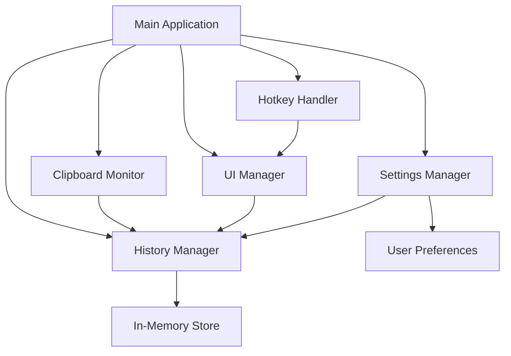

# Design Document: Kliply

## Overview

Kliply is a native macOS application that provides Windows 11-style clipboard history functionality. The application runs as a lightweight background daemon that monitors the system clipboard, maintains an in-memory history of copied items, and presents a beautiful popup interface when activated via keyboard shortcut.

The design emphasizes simplicity, performance, and native macOS integration. The application will be built using Python with native macOS frameworks for UI and system integration, ensuring it meets App Store requirements while providing a polished user experience.

## Architecture

The application follows a modular architecture with clear separation of concerns:



### Core Components

1. **Main Application**: Entry point that initializes all components and manages the application lifecycle
2. **Clipboard Monitor**: Background daemon that polls the system clipboard for changes
3. **History Manager**: Manages the in-memory clipboard history with depth limits
4. **UI Manager**: Handles the history popup window, settings panel, welcome screen, and permission dialogs
5. **Settings Manager**: Manages user preferences (clipboard depth, hotkey configuration)
6. **Hotkey Handler**: Registers and responds to global keyboard shortcuts
7. **Permission Manager**: Handles macOS permission requests and status checking
8. **Onboarding Manager**: Manages first-run experience and user education

### Technology Stack

- **Language**: Python 3.9+
- **UI Framework**: PyQt6 (native macOS integration, App Store compatible)
- **Clipboard Access**: PyQt6.QtGui.QClipboard
- **Global Hotkeys**: pynput or PyQt6 global shortcuts
- **Packaging**: py2app for macOS application bundle
- **Code Signing**: Apple Developer tools for notarization

## Components and Interfaces

### 1. Clipboard Monitor

**Responsibility**: Continuously monitor the system clipboard and detect changes.

**Interface**:
```python
class ClipboardMonitor:
    def __init__(self, history_manager: HistoryManager)
    def start() -> None
    def stop() -> None
    def _on_clipboard_change(content: ClipboardContent) -> None
```

**Behavior**:
- Polls system clipboard every 500ms using QClipboard
- Detects changes by comparing content hash
- Extracts content type (text, image, rich text)
- Notifies HistoryManager of new content
- Runs on separate thread to avoid blocking main UI

### 2. History Manager

**Responsibility**: Maintain in-memory clipboard history with configurable depth.

**Interface**:
```python
class HistoryManager:
    def __init__(self, max_depth: int = 10)
    def add_item(content: ClipboardContent) -> None
    def get_history() -> List[ClipboardContent]
    def set_max_depth(depth: int) -> None
    def clear_history() -> None
    def get_item(index: int) -> ClipboardContent
```

**Behavior**:
- Stores items in a deque with maximum size
- Moves duplicates to front (most recent)
- Automatically trims when depth is reduced
- Thread-safe operations using locks

### 3. UI Manager

**Responsibility**: Display and manage the history popup, settings panel, welcome screen, and permission dialogs.

**Interface**:
```python
class UIManager:
    def __init__(self, history_manager: HistoryManager)
    def show_history_popup() -> None
    def show_settings_panel() -> None
    def show_welcome_screen() -> None
    def show_permission_dialog(permission_type: str) -> None
    def hide_popup() -> None
```

**History Popup Design**:
- Centered window, 500x400px
- Frameless with rounded corners
- Semi-transparent background (#1E1E1E with 95% opacity)
- List view with custom item renderer
- Keyboard navigation support
- Smooth fade-in/out animations

**Item Rendering**:
- Text items: Show first 50 characters with ellipsis
- Images: Show 40x40px thumbnail
- Rich text: Show plain text preview
- Each item shows type icon and timestamp

### 4. Settings Manager

**Responsibility**: Manage user preferences in memory and provide configuration interface.

**Interface**:
```python
class SettingsManager:
    def __init__(self)
    def get_clipboard_depth() -> int
    def set_clipboard_depth(depth: int) -> None
    def get_hotkey() -> str
    def set_hotkey(hotkey: str) -> None
    def get_launch_at_login() -> bool
    def set_launch_at_login(enabled: bool) -> None
```

**Settings Panel Design**:
- Native macOS preferences window
- Slider for clipboard depth (5-100)
- Hotkey recorder widget
- Launch at login checkbox
- About section with version info

### 5. Hotkey Handler

**Responsibility**: Register and respond to global keyboard shortcuts.

**Interface**:
```python
class HotkeyHandler:
    def __init__(self, callback: Callable)
    def register_hotkey(hotkey: str) -> bool
    def unregister_hotkey() -> None
```

**Behavior**:
- Default hotkey: Cmd+Shift+V
- Uses PyQt6 global shortcuts or pynput
- Prevents duplicate activations
- Handles permission requests on macOS

### 6. Menu Bar Integration

**Responsibility**: Provide system tray/menu bar presence.

**Interface**:
```python
class MenuBarManager:
    def __init__(self, ui_manager: UIManager, settings_manager: SettingsManager)
    def create_menu() -> None
    def update_menu() -> None
```

**Menu Items**:
- Show History (Cmd+Shift+V)
- Settings...
- Clear History
- ---
- Quit

### 7. Permission Manager

**Responsibility**: Handle macOS permission requests and status checking.

**Interface**:
```python
class PermissionManager:
    def check_accessibility_permission() -> bool
    def request_accessibility_permission() -> None
    def check_all_permissions() -> Dict[str, bool]
    def open_system_preferences(pane: str) -> None
```

**Behavior**:
- Checks Accessibility permissions for global hotkeys
- Provides user-friendly explanations before system prompts
- Monitors permission status changes
- Opens System Preferences to relevant panes
- Handles degraded mode when permissions are denied

**Permission Dialog Design**:
- Custom dialog before system prompt
- Clear explanation of why permission is needed
- Screenshots showing System Preferences steps
- "Open System Preferences" button
- "I'll Do This Later" option

### 8. Onboarding Manager

**Responsibility**: Manage first-run experience and user education.

**Interface**:
```python
class OnboardingManager:
    def should_show_welcome() -> bool
    def show_welcome_screen() -> None
    def mark_welcome_complete() -> None
    def demonstrate_popup() -> None
```

**Welcome Screen Design**:
- Friendly welcome message with Kliply branding
- Large visual showing Cmd+Shift+V keyboard shortcut
- Brief explanation: "Press Cmd+Shift+V anytime to see your clipboard history"
- "Try It Now" button that demonstrates the popup
- "Get Started" button to dismiss and begin using
- Checkbox: "Don't show this again"

**Behavior**:
- Shows only on first launch
- Checks for required permissions before main app starts
- Guides user through permission setup if needed
- Can be re-accessed from Settings menu

## Data Models

### ClipboardContent

Represents a single clipboard item with metadata.

```python
@dataclass
class ClipboardContent:
    content_type: ContentType  # TEXT, IMAGE, RICH_TEXT
    data: Union[str, bytes, QImage]
    timestamp: datetime
    preview: str  # Truncated preview for display
    size_bytes: int
    
    def get_hash() -> str
    def to_clipboard_format() -> QMimeData
```

### ContentType

Enumeration of supported clipboard content types.

```python
class ContentType(Enum):
    TEXT = "text"
    IMAGE = "image"
    RICH_TEXT = "rich_text"
    UNSUPPORTED = "unsupported"
```

### Settings

Configuration data structure.

```python
@dataclass
class Settings:
    clipboard_depth: int = 10
    hotkey: str = "Cmd+Shift+V"
    launch_at_login: bool = False
    first_launch_complete: bool = False
    
    def validate() -> bool
```

### PermissionStatus

Tracks permission states.

```python
@dataclass
class PermissionStatus:
    accessibility: bool = False
    last_checked: datetime = None
    
    def all_granted() -> bool
```

## Correctness Properties

A property is a characteristic or behavior that should hold true across all valid executions of a system—essentially, a formal statement about what the system should do. Properties serve as the bridge between human-readable specifications and machine-verifiable correctness guarantees.

### Property 1: New content is added to history

*For any* clipboard content, when it is copied to the system clipboard, it should appear in the Clipboard_History.

**Validates: Requirements 1.2**

### Property 2: Duplicate content moves to front

*For any* clipboard content that already exists in the history, when it is copied again, it should move to the front of the Clipboard_History and the total history size should not increase.

**Validates: Requirements 1.3**

### Property 3: History respects depth limit

*For any* sequence of clipboard items exceeding the configured Clipboard_Depth, the Clipboard_History should never exceed the depth limit and should remove the oldest entries first.

**Validates: Requirements 1.4**

### Property 4: Depth changes are applied immediately

*For any* new Clipboard_Depth value (including reductions below current history size), when the depth is changed, the Clipboard_History should immediately reflect the new limit by removing the oldest entries if necessary.

**Validates: Requirements 2.3, 2.4**

### Property 5: Depth validation

*For any* integer value, when setting the Clipboard_Depth, values between 5 and 100 (inclusive) should be accepted, and values outside this range should be rejected.

**Validates: Requirements 2.6**

### Property 6: Hotkey displays popup

*For any* application state where the History_Popup is not visible, when the Hotkey is pressed, the History_Popup should be displayed.

**Validates: Requirements 3.2**

### Property 7: Hotkey press idempotence

*For any* number of consecutive Hotkey presses while the History_Popup is visible, the popup should remain in the same state (no duplicate popups or state changes).

**Validates: Requirements 3.4**

### Property 8: History display order

*For any* Clipboard_History with multiple items, when the History_Popup is displayed, the items should appear in reverse chronological order (most recent first).

**Validates: Requirements 4.1**

### Property 9: Item preview truncation

*For any* clipboard item, when displayed in the History_Popup, the preview should be truncated to a maximum of 50 characters with visual indication if the original content is longer.

**Validates: Requirements 4.4, 4.5**

### Property 10: Popup closes on focus loss

*For any* History_Popup that is currently displayed, when the popup loses focus, it should close automatically.

**Validates: Requirements 4.7**

### Property 11: Popup closes on Escape

*For any* History_Popup that is currently displayed, when the Escape key is pressed, the popup should close.

**Validates: Requirements 4.8**

### Property 12: Item selection copies to clipboard

*For any* item in the History_Popup, when a user clicks on it, that item should be copied to the Active_Clipboard.

**Validates: Requirements 5.1**

### Property 13: Double-click copies and closes

*For any* item in the History_Popup, when a user double-clicks on it, that item should be copied to the Active_Clipboard and the popup should close.

**Validates: Requirements 5.2**

### Property 14: Enter key copies and closes

*For any* selected item in the History_Popup, when the Enter key is pressed, that item should be copied to the Active_Clipboard and the popup should close.

**Validates: Requirements 5.3**

### Property 15: Content type support

*For any* clipboard content of type plain text, rich text (RTF), or image, the Clipboard_Manager should successfully store it in the Clipboard_History and preserve its type.

**Validates: Requirements 7.1, 7.2, 7.3**

### Property 16: Image thumbnail generation

*For any* image content in the Clipboard_History, when displayed in the History_Popup, a thumbnail preview should be generated and displayed.

**Validates: Requirements 7.4**

### Property 17: Unsupported content handling

*For any* clipboard content of an unsupported type, the Clipboard_Manager should display a type indicator instead of attempting to preview the content.

**Validates: Requirements 7.5**

### Property 18: Format preservation round-trip

*For any* clipboard content (text, rich text, or image), when added to history and then copied back to the Active_Clipboard, the format and content should be preserved exactly.

**Validates: Requirements 7.6**

### Property 19: Error recovery during monitoring

*For any* error that occurs during clipboard monitoring, the Clipboard_Manager should log the error and continue monitoring without crashing.

**Validates: Requirements 9.5**

### Property 20: Keyboard navigation

*For any* History_Popup with multiple items, when arrow keys are pressed, the selection should move up or down accordingly through the list.

**Validates: Requirements 10.2**

### Property 21: Welcome screen shows on first launch

*For any* fresh installation of Kliply, when the application is launched for the first time, the welcome screen should be displayed before the main application starts.

**Validates: Requirements 11.1**

### Property 22: Permission detection and recovery

*For any* permission state change (granted or revoked), when Kliply checks permissions, it should detect the change and update its behavior accordingly without requiring a restart.

**Validates: Requirements 13.3**

## Error Handling

The application must handle errors gracefully to maintain reliability:

### Clipboard Access Errors
- **Scenario**: System clipboard is inaccessible or locked by another application
- **Handling**: Log error, skip the current polling cycle, continue monitoring
- **User Feedback**: None (silent recovery)

### Content Type Errors
- **Scenario**: Clipboard contains unsupported or corrupted data
- **Handling**: Store as "unsupported" type with type indicator
- **User Feedback**: Display type indicator in history popup

### Memory Pressure
- **Scenario**: Large images or content causing memory issues
- **Handling**: Implement size limits (e.g., 10MB per item), reject oversized content
- **User Feedback**: Log warning, skip item

### Hotkey Registration Failure
- **Scenario**: Hotkey already in use or permissions denied
- **Handling**: Show permission dialog with instructions, fall back to menu bar access only
- **User Feedback**: Display custom permission dialog before system prompt, show persistent menu bar indicator if denied

### Permission Denied
- **Scenario**: User denies Accessibility permissions
- **Handling**: Operate in degraded mode (menu bar only, no global hotkey)
- **User Feedback**: Show friendly explanation dialog, provide "Open System Preferences" button, display menu bar indicator

### UI Rendering Errors
- **Scenario**: Popup fails to render or display
- **Handling**: Log error, close popup, allow retry on next hotkey press
- **User Feedback**: None (silent recovery)

### Settings Validation Errors
- **Scenario**: Invalid settings values provided
- **Handling**: Reject invalid values, maintain current settings
- **User Feedback**: Show validation message in settings panel

## Testing Strategy

The application will use a dual testing approach combining unit tests and property-based tests to ensure comprehensive coverage and correctness.

### Property-Based Testing

Property-based testing will be used to verify universal correctness properties across many generated inputs. We will use **Hypothesis** (Python's property-based testing library) to implement these tests.

**Configuration**:
- Minimum 100 iterations per property test
- Each test will be tagged with: **Feature: clipboard-manager-pro, Property N: [property text]**
- Tests will use custom generators for clipboard content, UI events, and application state

**Property Test Coverage**:
- History management properties (Properties 1-3)
- Settings and depth management (Properties 4-5)
- Hotkey and popup behavior (Properties 6-11)
- Item selection and clipboard operations (Properties 12-14)
- Content type handling (Properties 15-18)
- Error recovery (Property 19)
- Keyboard navigation (Property 20)

**Example Property Test Structure**:
```python
from hypothesis import given, strategies as st

@given(st.text(min_size=1))
def test_property_1_new_content_added(content):
    """Feature: Kliply, Property 1: New content is added to history"""
    manager = HistoryManager()
    manager.add_item(ClipboardContent(ContentType.TEXT, content, datetime.now()))
    assert content in [item.data for item in manager.get_history()]
```

### Unit Testing

Unit tests will verify specific examples, edge cases, and integration points:

**Core Functionality Tests**:
- Initialization with empty history (Requirement 1.5)
- Default clipboard depth of 10 (Requirement 2.2)
- Default hotkey Cmd+Shift+V (Requirement 3.3)
- Popup centered on screen (Requirement 4.2)
- Most recent item pre-selected (Requirement 10.3)

**Edge Cases**:
- Empty clipboard content
- Very long text items (>1000 characters)
- Large images (>5MB)
- Rapid clipboard changes
- Concurrent access to history

**Integration Tests**:
- Clipboard monitor integration with history manager
- UI manager integration with history manager
- Settings changes propagating to all components
- Menu bar actions triggering correct behaviors

**UI Tests**:
- Settings panel contains depth control (Requirement 2.1)
- Hotkey registration on startup (Requirement 3.1)
- Menu bar icon presence (Requirement 6.3)
- Menu bar options (Requirement 6.4)
- Visual feedback for selection (Requirement 5.5)
- Keyboard focus capture (Requirement 10.7)
- Clean shutdown (Requirement 6.6)
- Immediate monitoring on startup (Requirement 6.2)

### Test Organization

```
tests/
├── unit/
│   ├── test_history_manager.py
│   ├── test_clipboard_monitor.py
│   ├── test_settings_manager.py
│   ├── test_ui_manager.py
│   └── test_hotkey_handler.py
├── property/
│   ├── test_history_properties.py
│   ├── test_settings_properties.py
│   ├── test_ui_properties.py
│   └── test_content_properties.py
└── integration/
    ├── test_end_to_end.py
    └── test_component_integration.py
```

### Testing Tools

- **pytest**: Test runner and framework
- **hypothesis**: Property-based testing library
- **pytest-qt**: PyQt6 testing utilities
- **pytest-mock**: Mocking framework for isolation
- **coverage.py**: Code coverage measurement

### Success Criteria

- All property tests pass with 100+ iterations
- All unit tests pass
- Code coverage >85% for core components
- No memory leaks detected in 24-hour stress test
- UI responsiveness <200ms for all interactions
